# Notch

[](https://github.com/nickthelegend/notch/actions/workflows/ci.yml)
[](LICENSE)
[](https://github.com/SigNoz/agent-skills/pull/76)

**Mission control for a fleet of coding agents — with the whole fleet observable in
[SigNoz](https://signoz.io).** Every coding agent — Claude Code, Codex, OpenCode, Grok,
Antigravity, Kiro — keeps its own brain in its own files and runs blind to the others.
Notch makes them **one brain** with **one baton**: connect your agents and their memory,
decisions, and context become a single shared thread that flows from one agent to the next —
and **every turn, handoff, route, and memory fold is traced to SigNoz** as OpenTelemetry
`gen_ai` spans, so you can watch the fleet, its cost, and its tokens in real time.

Today that means **Claude Code, Codex, OpenCode, Grok Code and the Antigravity CLI**
(offload a turn to Gemini to save tokens) as full agents, each verified against a real
version, plus **Kiro** driven through its own
window — see [Supported agents](#supported-agents) for exactly how far each one goes, and
[How memory actually reaches a model](#how-memory-actually-reaches-a-model) for the part
most tools gloss over.

Notch is **not** another IDE. It's the thin layer *between* your agents — the continuity,
memory, and **observability** they don't have on their own. It grew out of an
earlier orchestrator called *loom* — which is still the name of the CLI binary and
the `.loom/` directory — and adds a purple-dark identity, an in-app
**[Observatory](#observability--signoz)** (live canvas, handoff graph, event timeline, fleet
metrics), and end-to-end SigNoz instrumentation built on top.

```
   CLAUDE.md      AGENTS.md      .antigravity/     ← each ADE's native memory
       │              │               │
       └──────────────┼───────────────┘   import
                      ▼
            ╔═══════════════════╗
            ║  ONE SHARED BRAIN ║   decisions · imported ADE memory · the thread
            ╚═════════╤═════════╝
                      │  projected on every handoff
       ┌──────────────┼───────────────┐
   Claude Code ──▶ OpenCode ──▶ Claude Code      ← baton carries the brain forward
     (plan)        (execute)      (review)
```

<p align="center">
  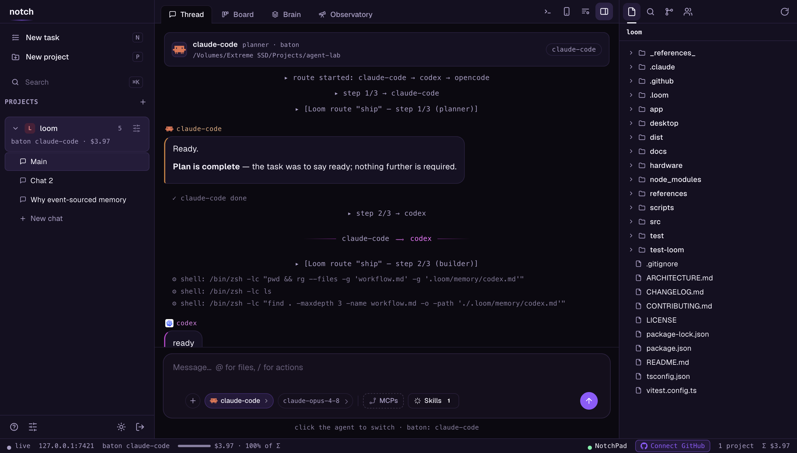
  <br>
  <em>One thread over every agent — projects and chats on the left, the shared conversation in the middle, the Explorer on the right, and a composer you switch agents from without leaving the box.</em>
</p>

## Observability — SigNoz

A fleet of agents you can't see is a fleet you can't trust. Notch instruments the whole
orchestration and ships it to **SigNoz** using the OpenTelemetry
[GenAI semantic conventions](https://opentelemetry.io/docs/specs/semconv/gen-ai/) — plus an
in-app **Observatory** so you never have to leave the app to know what the fleet is doing.

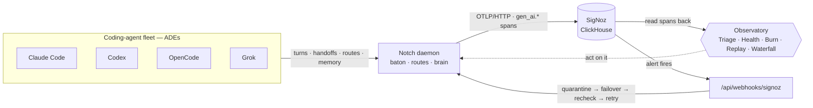

The write path is the top arrow (fleet → daemon → SigNoz). The two bottom arrows are the
**read-back** — Notch querying its own spans to triage/score/self-heal the fleet.

### The Observatory

A tab next to the Brain — **eight live views** over the running project, all backed by real
data (SigNoz spans / event log, no mocks). A persistent vitals strip (active agents, baton
holder, spend, turns, tokens) sits above them, **View in SigNoz** jumps to the traces, and
**Ask Noz** answers questions about the fleet from the same telemetry these views render.

Each view is named for the question it answers, and says so in a line under the tabs.

| View | What it shows | Source |
|---|---|---|
| **Metrics** | the dashboard: totals, then what the spend is *made of* (token and turn donuts per agent/model), then behaviour over time (turn duration, token usage, spend), then each agent's 0–100 **Health** with **⚠ Triage**, then the 24h burn with per-agent USD/day **budgets** | `/metrics` + spans + ClickHouse |
| **Live fleet** | *right now* — who is running, who is idle, who holds the **baton**, and an edge that marches while an agent is reading and writing the one shared brain (draggable) | live state |
| **Handoffs** | *what already happened* — the baton's actual route between agents, each edge labelled with how many times it was taken, thickest where it was walked most (draggable) | event log |
| **Self-heal** | what SigNoz told Notch, and what Notch *did about it* — every alert episode as a row: which agent was taken out of rotation, when, who the baton moved to, and whether it was handed back. This is the half SigNoz cannot show you: SigNoz knows the alert fired, only Notch knows the fleet reacted. A **Lift** button releases a paused agent by hand | alert webhook + event log |
| **Timeline** | the chronological trace — turns, handoffs, routes, memory folds, errors, 💡 **decisions**, budget pauses, MCP attach, and the **self-heal** intervention/recovery lines | event log |
| **Decisions** | a filterable **Decision Explorer** — every agent choice as a card, with reason, alternatives, files, and how each decision was extracted (a measured confidence and a pattern match are not shown as the same claim) | decisions store |
| **Logs** | the fleet's structured logs read back **out of SigNoz** — every message, tool call, file edit and error at the severity it was recorded, filterable by severity and text. A line belonging to a turn carries its **trace**, so you can jump from a log line to the span that produced it. One of the views with **no local fallback** (the Metric Explorer and the burn series have none either): if ClickHouse isn't answering it says so, rather than showing an empty list that looks like a quiet run | SigNoz / ClickHouse |
| **Replay** | scrub the whole run: at any moment, who held the baton, every agent's state, decisions so far, the thread — *and* the turn that was running then, with its model, duration, tokens, cost and trace. Play / step controls | folded event log + spans |

**Decision capture.** After each turn, Notch mines the agent's prose into structured decisions
(category, reasoning, confidence, alternatives, files), through whichever extractor the machine
actually has — **three** tiers, in descending order of how far the confidence number can be
trusted:

1. the **Anthropic API**, when `ANTHROPIC_API_KEY` is set;
2. failing that, a **local agent CLI** driven headlessly — `agy --print` if Antigravity is
   installed, else `claude -p`. Worth knowing about: this tier is the default, so a machine
   with no API key still shells out to a model and **spends real tokens** on every turn.
   `NOTCH_DECISIONS_NO_CLI=1` turns it off;
3. failing that, a deterministic **regex**, which carries no confidence at all rather than
   stamping an invented percentage.

They power the Decisions Explorer, the Timeline's 💡 lines, and the Time-Travel snapshots.

Reading the spans **back out of SigNoz** is the agent-native part — Metrics, Logs, burn, the
Metric Explorer and Replay all do it. Three go further than rendering what they read:

- **Agent Health Score (0–100).** A per-agent badge from a pure, unit-tested formula over the
  agent's own spans: four penalty buckets (error rate ≤40, latency ≤25, token bloat ≤20, recent
  error ≤15) → healthy / degraded / unhealthy, with a click-through breakdown.
- **Agent Self-Triage ("why did I fail?").** Pulls the agent's own `gen_ai.*` spans from SigNoz
  (local-log fallback), finds the most recent failure and the **upstream handoff** that led into
  it, and root-causes it — with LLM prose when an `ANTHROPIC_API_KEY` or signed-in `claude` CLI
  is present, deterministic heuristic otherwise. Also shipped as a custom
  [SigNoz skill (PR #76)](https://github.com/SigNoz/agent-skills/pull/76).
- **Trace Waterfall + deep link.** Click a turn → its trace's spans as time-positioned bars,
  with **View full trace in SigNoz ↗**.

### Screenshots

**Metrics — the fleet with per-agent Health scores** (claude-code & opencode `100`, codex `63`
after it errored) and a **⚠ Triage** button each:

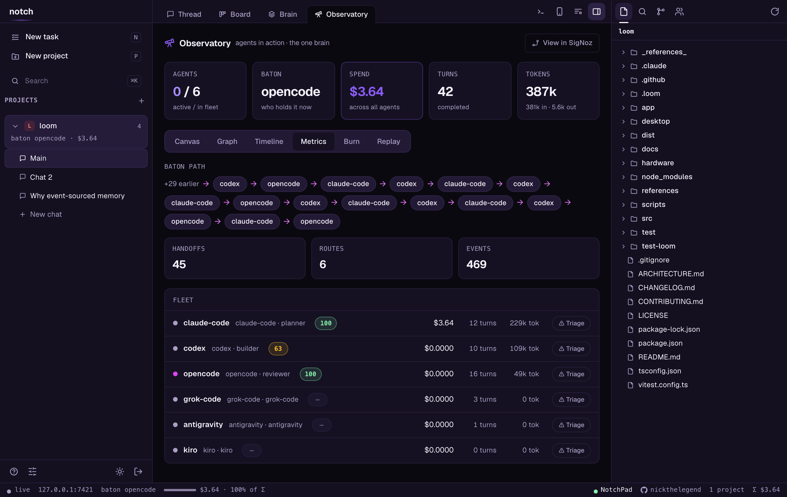

**Live fleet** — every agent hanging off the one shared brain, the baton edge marching
between the brain and whoever holds it:

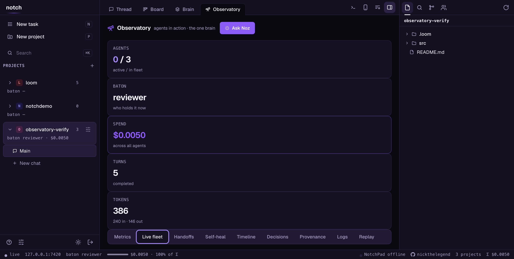

**Self-heal** — what SigNoz told Notch and what Notch *did about it*. The top row is one
complete episode: a `AgentErrorRateHigh` alert fired against the agent holding the baton, the
baton moved to `claude-code`, the alert resolved 17 seconds later, and the baton was handed
back — SigNoz knew the alert fired, only Notch knows the fleet reacted:

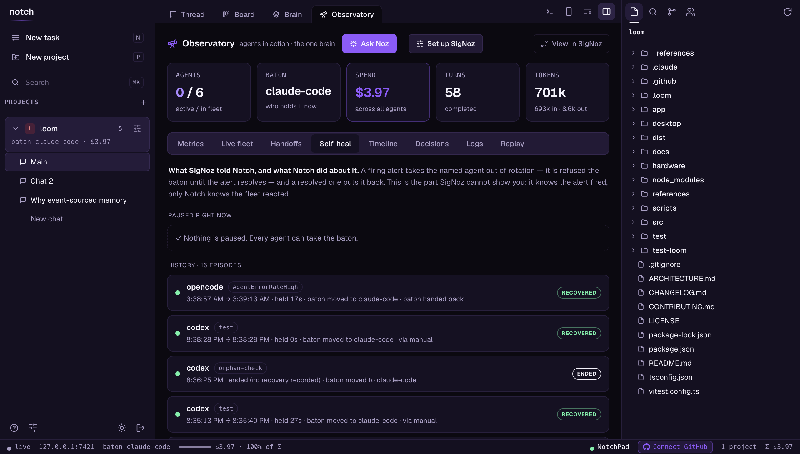

**Logs** — the fleet's structured logs read back out of SigNoz, each line carrying the trace
of the turn that produced it:

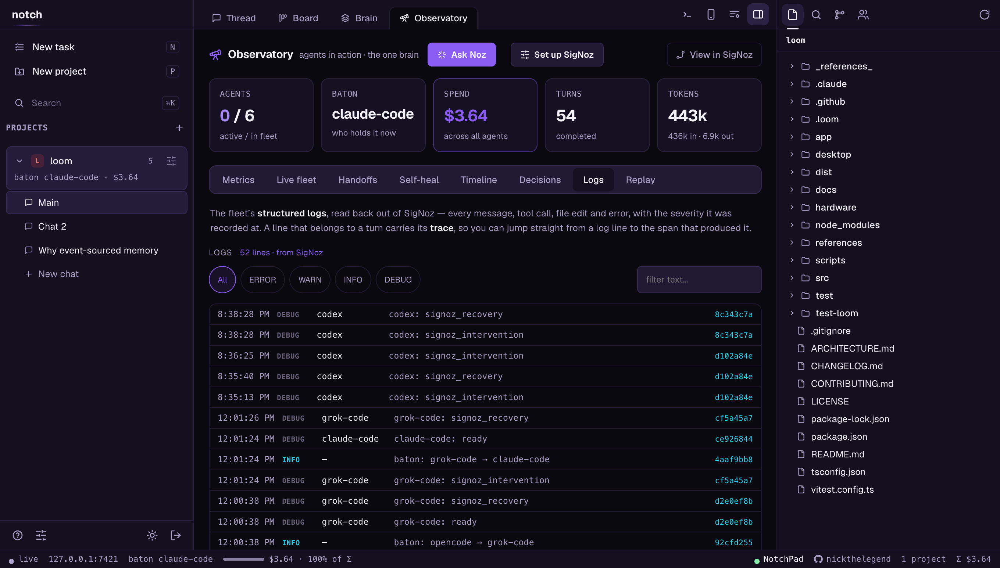

**Metric Explorer** — every series Notch exports, queried back out of SigNoz over a 1h/6h/24h/7d
window, with its instrument type, unit and labels. A series with one datapoint says "single
point" rather than drawing a line through nothing:

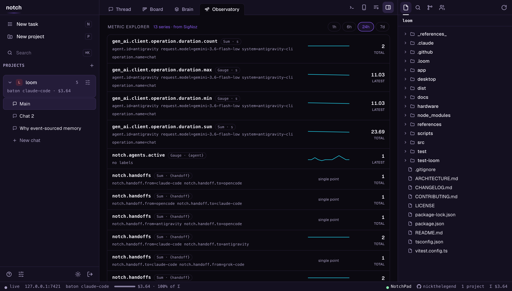

**Self-Triage — an agent root-caused from its own SigNoz spans**, and the **Replay → Trace
Waterfall** with the SigNoz deep link:

| Triage | Trace Waterfall |
|---|---|
| 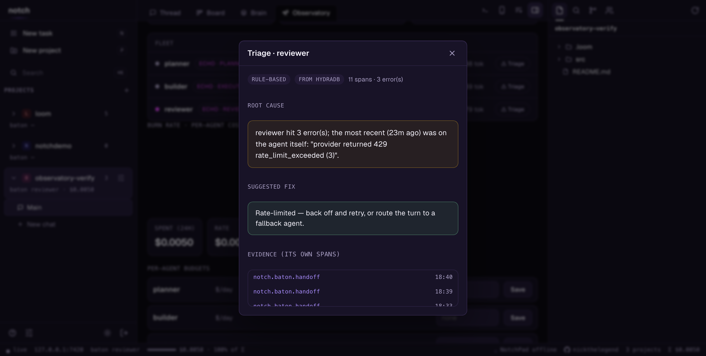 | 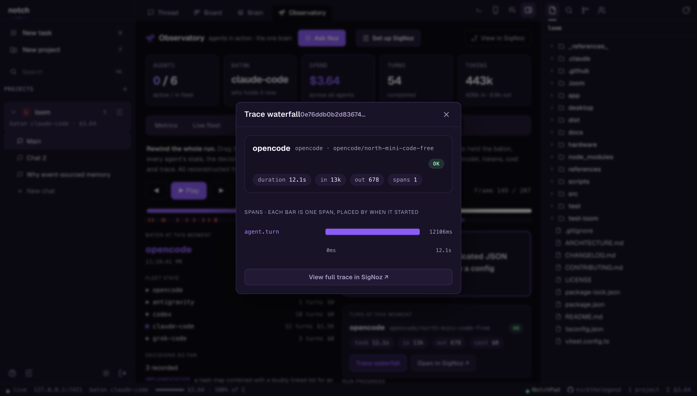 |

**Burn rate** (per-agent cost + projection + budgets) and the **fleet readiness** panel
(each ADE's sign-in state):

| Burn | Fleet readiness |
|---|---|
| 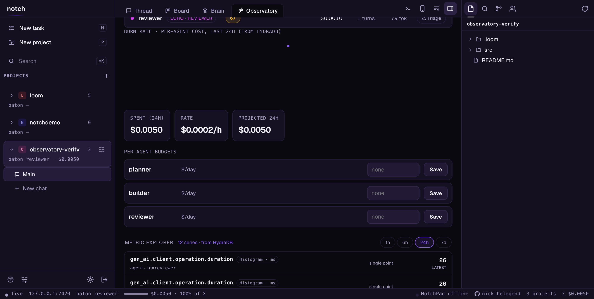 | 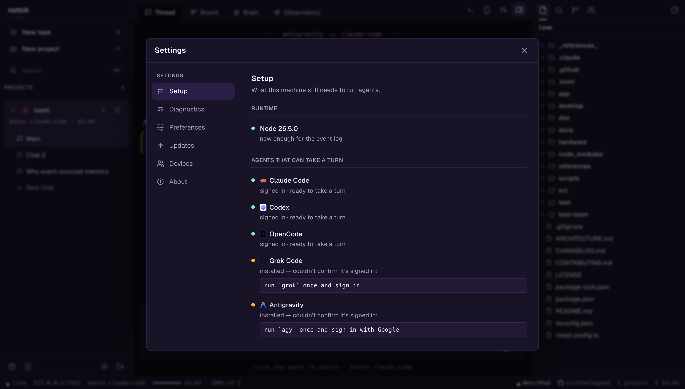 |

**Decision Explorer** — every agent choice as a card with reason, alternatives, and confidence:

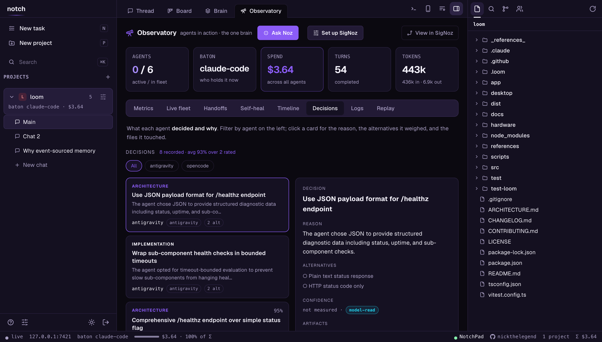

**Time-Travel Replay** — scrub any frame of the run and see the exact fleet state, baton,
decisions, memory, and thread at that instant:

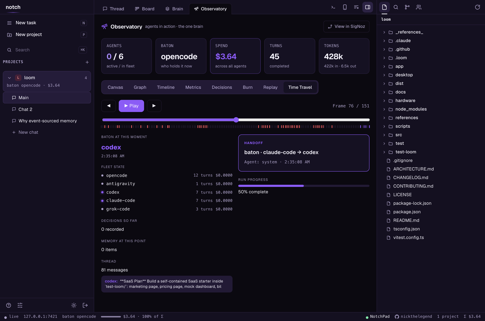

**Dense KAIRO-style metrics grid** — agents, files, tokens, cost, critical path, confidence,
retries, with sparklines and per-agent token bars:

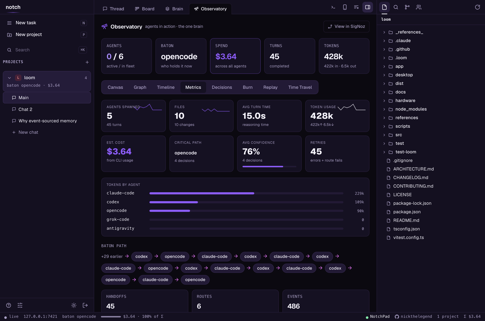

**The composer** — an **AUTO** chip (dynamic routing) or a specific agent, MCP + Skills slots,
and a smart **skill suggestion** banner that surfaces a relevant skill as you type:

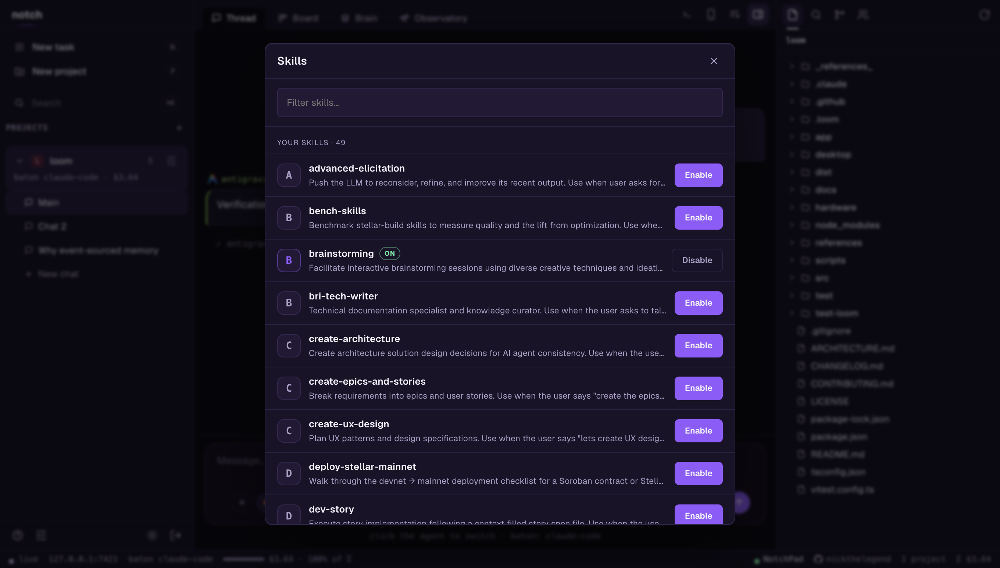

### Self-heal: SigNoz alert → intervention → recovery

Notch closes the loop the other way too. A SigNoz **alert** (error rate, latency, cost budget)
posts to `POST /api/webhooks/signoz`:

- **firing** → the failing agent is **quarantined** and the baton **fails over** to a fallback;
- then a background **recheck loop** (every `NOTCH_HEAL_RECHECK_MS`, default 60s) asks SigNoz
  whether the agent has stopped erroring and, if so, **hands the baton back** — retrying up to
  `NOTCH_HEAL_MAX_RETRIES` (default 3) times;
- a **resolved** alert is the fast lane for the same restoration.

Metric breach → intervention → recovery → retry, all visible as green/violet lines in the
Timeline.

### SigNoz export

The daemon is already a stream of events; Notch folds the notable ones into OTel spans over a
single central hook and exports them **OTLP/HTTP (JSON)** — no OpenTelemetry SDK dependency,
just `fetch`, batched and best-effort (an unreachable collector never touches the agent loop).

| Event | Span | Key attributes |
|---|---|---|
| agent turn | `gen_ai.agent.turn` | `gen_ai.agent.id`, `gen_ai.request.model`, `gen_ai.usage.input_tokens` / `output_tokens`, `gen_ai.usage.cost_usd`, duration |
| tool call | `gen_ai.tool.call` | `gen_ai.tool.name` |
| baton handoff | `notch.baton.handoff` | `notch.handoff.from` / `.to` |
| route lifecycle | `notch.route.<phase>` | `notch.route.id` |
| memory fold | `notch.memory.<op>` | `notch.memory.kind` / `.scope` |
| error | `notch.error` (ERROR status) | message |

Every span carries `service.name = notch`, plus `notch.project` and `notch.chat`.

### LLM cost tracer

Notch tracks **cost and tokens per agent** — turns, spend, input/output tokens — read straight
from what each CLI reports, and reports nothing where a CLI reports nothing. **Claude Code**
(`result` usage) and **OpenCode** (message tokens) hand over both cost *and* tokens.
**Codex** (`turn.completed`) and **Grok** hand over **tokens only**, so their spend stays at
zero rather than being back-derived from a price table we'd have to keep current. The
**Antigravity CLI** hands over neither, so its turns carry a model and a duration and no
numbers. It's exposed at
`GET /api/projects/:id/metrics` and shipped to SigNoz as the `gen_ai.usage.*` span attributes.

### Point it at your SigNoz, or turn it off

Self-hosted works out of the box (exports to `http://localhost:4318`). For another collector or
SigNoz Cloud, set `NOTCH_OTEL_ENDPOINT` (and `SIGNOZ_INGESTION_KEY`). Opt out entirely with
`DO_NOT_TRACK=1`, `NOTCH_TELEMETRY_DISABLED=1`, or `NOTCH_OTEL=0`. A ready-to-import dashboard
ships at [`docs/signoz-dashboard.json`](docs/signoz-dashboard.json); full details in
[`docs/observability.md`](docs/observability.md).

**Know which source you are actually reading.** Notch degrades honestly when SigNoz is
unreachable: `/insights/spans` reports `from: "local-log"`, trace ids come back empty, and the
Replay tab says *"this turn came from the local event log"* instead of offering a trace
waterfall. That is real data — it is Notch's own event log, the same turns and token counts the
CLIs reported — but it is **not** SigNoz, and it is easy to run that way for days without
noticing. To bring the local stack up and check:

```bash
./scripts/signoz-up.sh                              # zookeeper → clickhouse → collector → UI
NOTCH_SIGNOZ_URL=http://localhost:8085 loom up      # so deep links reach that UI

curl -s localhost:7420/api/projects/<id>/insights/spans | jq .from   # must say "signoz"
```

Start order matters and the script enforces it: ClickHouse needs its keeper first, and a
collector that booted while ClickHouse was down keeps failing its exporter until it is bounced —
which looks exactly like "ingestion is broken".

The exporter and the event→span mapping are covered by unit **and** integration tests
(a stand-in OTLP collector receives real spans from live daemon turns):

```bash
npm test -- observability          # config, mapper, OTLP payload shape
npm test -- observability-export   # end-to-end: daemon turns → collector spans
```

## Codex & GPT‑5.6

Notch is built around orchestrating **OpenAI Codex** as a first‑class agent, and Codex's own
current models are the GPT‑5.6 family. Notch does not pin one for you: the adapter takes an
optional `model` in the agent's `options`, and `.loom/config.json` is per‑machine and
gitignored, so what a turn runs is whatever your Codex is set to unless you say otherwise.
The in‑app model picker asks the CLI rather than shipping a stale list — on the machine this
was built on, `codex debug models` answered `gpt-5.6-terra, gpt-5.6-luna, gpt-5.5,
gpt-5.4-mini`. There is no reasoning‑effort setting on the Codex adapter (`--effort` exists
on `antigravity-cli`, not here).

- **Codex holds the baton like any other agent.** The adapter
  ([`src/adapters/codex.ts`](src/adapters/codex.ts)) drives `codex exec --json` headless:
  it opens a thread, streams Codex's JSONL event log (`thread.started`, `item.completed`
  → `agent_message` / `command_execution` / `file_change`, `run_complete`), and **resumes
  the same thread across turns** so Codex keeps its own context between handoffs.
- **Codex reads and writes the shared brain.** Before a Codex turn, Notch projects the
  unified memory (imported ADE memory + decisions + the thread) into its briefing; its
  replies and memory writes land back in the one shared store. So a handoff
  *Claude Code → Codex* carries the full context, and the next agent inherits what Codex
  learned. *(What the test suite pins is the plumbing, not a live model:
  [`test/codex.test.ts`](test/codex.test.ts) drives the adapter against a fake `codex` on
  disk to hold the event parsing and thread resume in place, and
  [`test/brain-shared.test.ts`](test/brain-shared.test.ts) proves the cross‑agent brief with
  a stub extractor. Whether a real Codex recalls a real value across a handoff is something
  to check on your own machine.)*
- **Voice, on real hardware — designed, not shipped.** The **LoomPad** is a physical
  ESP32‑S3 macropad whose intended loop is: press the **Codex** key to hand Codex the baton,
  hold the mic and speak, hear the reply spoken back through the pad. What exists in this
  repo is the enclosure — [`hardware/orchestrator-pad/`](hardware/orchestrator-pad/README.md)
  ships printable CAD, STLs and a sketch of the JSON protocol, and its own README still
  lists firmware, the hand‑wire guide and the daemon‑side pairing flow as to-do. The daemon
  has the proxy endpoints (`/api/loompad/health`, `/api/loompad/connect`), but the voice
  backend they point at is not in this repo. You cannot reproduce this loop today.
- **Codex as a dev agent, too.** Because Codex is a full agent, you can hand it real work
  inside Notch — `loom route ship "…"` routes *plan → Codex executes → review*, the brain
  flowing hop to hop.

In short: **Codex — and whichever GPT‑5.6 model it is running — is one of the interchangeable
minds Notch keeps in sync.** Start a thread in Claude Code, hand it to Codex mid‑task, and it
picks up with the whole shared context intact.

## Why

Every coding agent keeps its own brain. Claude Code's memory can't be read by
OpenCode; Antigravity doesn't know what you decided with Claude an hour ago. Switch
tools and you re-explain your project every time.

Other multi-agent tools answer this by keeping agents **apart** — each in its own
worktree, run in parallel, compare and merge. Notch makes the opposite bet: keep the
agents' **memory together** so work *continues* across them instead of forking.

- **One brain across every ADE** — Notch imports each agent's native memory
  (`CLAUDE.md`, `AGENTS.md`, …) into a unified store, merges it with your decisions and
  the shared thread, and hands the whole thing to whoever picks up next. `loom memory`.
- **The baton** — exactly one agent works at a time; passing it *carries the context*
  (interrupt-safe, memory projected, briefing armed). Not isolation — continuation.
- **Routes** — let Notch drive the chain: `loom route ship "add dark mode"` runs
  plan → execute → review as one command, the brain flowing hop to hop; or `loom route
  auto` lets an LLM pick each next agent.
- **Every surface, one daemon** — a full-screen TUI, a web app, a desktop window, and a
  phone app (voice input, per-prompt diffs, push) — each a paired client of the same
  local daemon over your tailnet.
- **Local-first & yours** — one `npm i -g`, no account, MIT, runs headless on a server.

## Install

Requires **Node ≥ 22.5** — `package.json` pins it because the event log's default store is
the built-in `node:sqlite`. That's the supported floor, not an absolute wall: on a runtime
without that module the log falls back to a portable JSONL store on its own (Electron's
bundled Node is exactly that case, which is why `LOOM_NODE` exists).

```bash
npm install -g notch          # → `notch` on your PATH
```

Other paths:

```bash
# one-liner from source (clones ~/.loom-src, builds, links; re-run to update)
curl -fsSL https://raw.githubusercontent.com/nickthelegend/notch/main/scripts/install.sh | bash

# straight from git
npm install -g github:nickthelegend/notch

# hackable checkout
git clone https://github.com/nickthelegend/notch.git && cd notch
npm install && npm run build && npm link
```

Then verify the setup:

```bash
loom doctor        # checks node, agents, tailscale, daemon, and your project
```

Surfaces, all talking to the same daemon:
- **TUI / CLI** — `loom` (default), `loom chat`, `loom send`, …
- **Desktop app (Notch Desktop)** — prebuilt for
  [**macOS**, **Linux**, and **Windows**](https://github.com/nickthelegend/notch/releases/latest)
  (`.dmg` for Apple Silicon and Intel · `.AppImage` · `.deb` · `.exe`; the macOS dmg is
  **unsigned** — there is no Developer ID identity on the release build — so right-click →
  **Open** the first time, and the release ships `SHA256SUMS.txt` if you want to check what
  you downloaded), or build from [`desktop/`](desktop/README.md): `cd desktop && npm
  install && npm start`. Either way it opens a native window that starts the daemon and
  pairs itself.
- **Phone app (Notch for Android)** — not to be confused with the LoomPad, which is the
  physical macropad above; the phone app is just **Notch**. Install the prebuilt
  [`notch-<version>-android.apk`](https://github.com/nickthelegend/notch/releases/latest) (allow unknown
  sources), open **Notch**, and **Scan QR code** from the desktop's *Connect a phone*.
  Voice input, per-prompt diffs, push. Or build from source
  ([`app/`](app/README.md)): `cd app && npx expo install && npx expo start`.
- **Web app** — no install; `loom pair` → open the link. Same workspace in the browser.

## The workspace

On a wide screen the web app (and the desktop shell around it) is a full workspace for
*driving* agents — still not an editor: Notch shows you the context and the agents do
the writing.

```
┌───────────┬────────────────────────────┬──────────────┐
│ projects  │  Thread · Board · Brain    │  Explorer    │
│  └ chats  │                            │  Search      │
│           │  the conversation, with    │  Source ctl  │
│ New task  │  Update(n files) cards ────┼─▶ diff opens │
│ New proj  │                            │  Agents      │
│ Search    ├────────────────────────────┤              │
│           │  terminal (a real shell)   │              │
└───────────┴────────────────────────────┴──────────────┘
  live · host · baton · spend                    ← status bar
```

- **Projects + chats** in the left rail: a project holds as many conversations as you
  want, and they share one brain, one baton and one working tree. The **agents** live in
  the right panel — click one to aim your next message at it, click its role to rename
  the job (roles are free text: "architect", "the one that writes docs", anything).
- **Thread** is the shared conversation; **Brain** is the unified memory; **Board**
  is everything in flight.
- **Board** is one board with three sources — **GitHub**, **Projects**, **Linear** —
  switched from a segmented control (see [GitHub & Linear, native](#github--linear-native)).
  GitHub is four live columns (working → needs you → in review → ready to merge); cards
  come from **yours** (`+ Task`), **Notch** (which agents are running or blocked), and
  your repo's **PRs** (draft, CI failed, changes requested, approved — read through your
  own `gh`). Search issues and PRs in GitHub's own query language; **Start** hands an
  issue to an agent. Dragging your own card really moves it; dragging a PR card only moves
  where you *see* it — the badge keeps telling the truth, because a drag can't approve a
  review or turn CI green. Each card wears its agent's own logo.
- **Click any change** — an `Update(n files)` card, or a file in Source Control — and the
  diff opens to the right of the chat. It stays closed until you ask for it.
- **Explorer / Search / Source Control / Tasks** in the right panel; every column is
  drag-resizable (double-click a handle to reset).
- **Terminal** (`Ctrl` + `` ` ``) is a real terminal in the project directory — a
  proper pty, so the shell draws its own prompt and `vim`, `less`, `htop`, `^C`
  and `^Z` all behave. `node-pty` is optional: without it (Linux with no build
  toolchain) you get a pipe-backed shell instead, where `cd` and variables still
  persist and `^C` still works, driven a line at a time.
- **New task** (`n`) picks a project, a task, and **one agent — or several**, which run
  it as a pipeline, hop to hop. **New project** (`p`) adds a repo — a native folder
  picker in the desktop app — and reports which ADEs it found on the host.

### Settings, in one place

Everything about a Notch lives behind the gear in the bottom-left: **Setup** (what the
machine still needs to run agents), **Diagnostics** (`loom doctor`, run live on the
daemon), **Updates** (build rev, and how far the checkout is behind its remote),
**Preferences** (theme, the brain extractor, handoff brief style, default agent),
**Devices** (paired clients — revoke one, or pair another), and **About**.

<p align="center">
  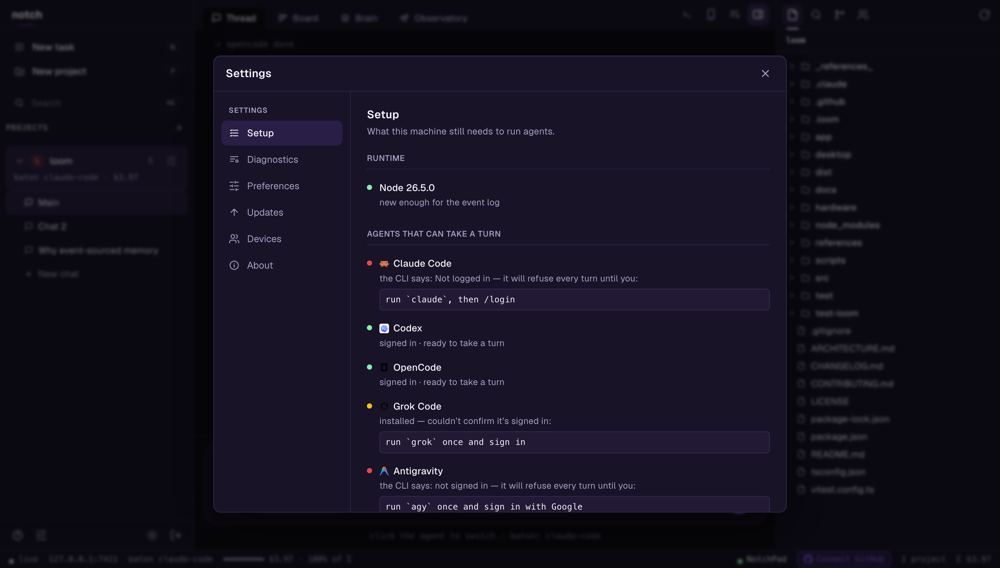
</p>

## GitHub & Linear, native

Browse pull requests, issues, and **GitHub Project boards** in-app; open a worktree from
any task; review and approve PRs; and file **Linear** issues with a team selector — no
context switch, no second browser tab.

<p align="center">
  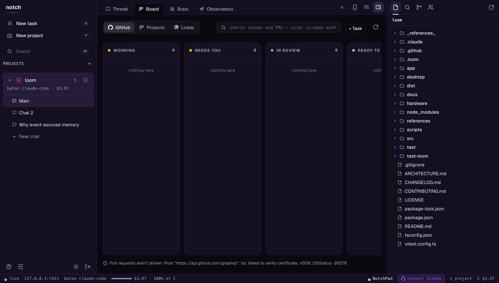
  <br>
  <em>A GitHub Project (v2) board, in-app — items grouped by their Status column, each linking back to its issue or PR.</em>
</p>

- **Browse PRs, issues, and Project boards.** The **GitHub** source is the live kanban;
  the **Projects** source lists the owner's GitHub Project (v2) boards and lays a
  project's items out by Status; search takes github.com's own query language.
- **Review and approve PRs in place.** Open a PR's diff without leaving Notch and post the
  three things a reviewer does — **comment**, **request changes**, **approve**. The review
  is signed as you (through your `gh`); approve asks first, because it publishes.
- **Open a worktree from any task.** One click cuts a checked-out branch in its own
  directory, a sibling of the repo: a **PR** worktree checks the branch out — forks
  included — and an **issue** worktree cuts a fresh branch to start it. An agent can work
  a PR while your main tree stays exactly where you left it.
- **Create Linear issues with a team selector.** Pick a team, write a title and
  description, file it — the new issue's identifier comes straight back.

<p align="center">
  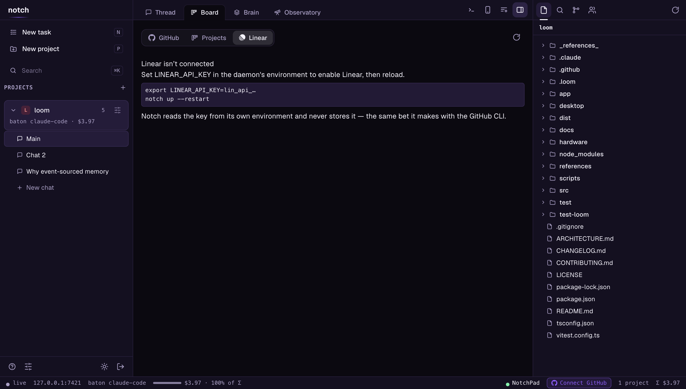
  <br>
  <em>Linear is off until you connect it — and Notch tells you exactly how, because it holds no token of its own.</em>
</p>

**Notch holds no token of its own.** GitHub goes through your `gh` CLI; Linear reads
`LINEAR_API_KEY` from the daemon's own environment (you `export` it) and never stores,
logs, or transmits it anywhere else. No key → an honest "not connected", never a dead
form — the same bet the agent adapters make by shelling out to the CLIs you already have.

## Quickstart

```bash
cd your-project
loom init          # detects the agents installed here and writes .loom/config.json
loom               # opens the TUI — a tabbed workspace (Thread · Board · Brain · Diff)
```

`loom init` names each agent after itself — `codex` is `codex` — and does **not**
hand out `planner` / `executor` / `reviewer`. A role is a job you define; Notch
doesn't know which of your agents should plan, and guessing from detection order
would look like a recommendation it hadn't earned. Rename them to the jobs you
actually have (the rail's agent picker, or `loom route`), and see
[Routes](#routes) before expecting `loom route ship` to exist.

**For the Observatory to show you anything, SigNoz has to be running.** Notch
works without it — the daemon, the baton, the shared brain and the thread are all
local and need nothing — but Metrics, Logs, Self-heal and the trace links all read
back out of SigNoz, and without it they say so rather than showing you zeros:

```bash
./scripts/signoz-up.sh          # brings the stack up in dependency order
# UI on http://localhost:8085 · OTLP on :4318
```

Notch ships to `http://localhost:4318` by default, so once the stack is up the
next turn you run is already traced. `NOTCH_TELEMETRY_DISABLED=1` turns it off.

```
  ██      ▄████▄  ▄████▄  ▄█▄▄█▄
  ██      ██  ██  ██  ██  ██▀▀██
  ██      ██  ██  ██  ██  ██  ██
  ██████  ▀████▀  ▀████▀  ██  ██
        one thread · every agent

  1 Thread   2 Board   3 Brain   4 Diff                          ↑12  pgup/pgdn
  10:44 claude-code  here's the plan: …
   ⟶ baton: claude-code → opencode
  10:45 opencode     implementing step 1 …

 ╭──────────────────────────────────────────────╮
 │ › Ask anything… "/route ship: add dark mode" │
 │ opencode · executor ⟵ baton                  │
 ╰──────────────────────────────────────────────╯
   shift+tab view · tab agent · ctrl+p palette · esc back/interrupt
   ~ my-project · baton opencode  ➤ ship 2/3
```

The TUI is a **tabbed workspace**, not just a thread:

- **Thread** — the conversation, streamed. **`tab` shifts the active agent/IDE**
  (claude-code → opencode → back); the handoff (interrupt-safe, memory projected, briefing
  armed) happens when you hit enter, so switching is one keystroke, not a ceremony.
- **Board** — agents, your cards, issues and PRs in the four flow columns.
- **Brain** — the memory the project has learned, grouped by kind (failures first), each
  tagged with who learned it.
- **Diff** — the working tree: changed files and a colourised patch.

**`shift+tab` cycles the tabs** (or `/board`, `/brain`, `/diff`, `/thread`, or the
palette); `pgup/pgdn` scrolls the view. **`ctrl+p` opens the command palette**
(fuzzy-filtered: jump to a view, shift to any agent, launch a named route, decision,
interrupt, pair…). `esc` steps back to the thread or interrupts the running turn; `/help`
lists the slash commands.

Prefer plain line-mode (SSH, scripts)? `loom chat` is the same thread as a classic REPL,
and every action also exists as a one-shot command (`loom send`, `loom handoff`, …).

## Routing — multi-hop pipelines

Handoffs are unlimited and manual by default. **Routes** automate a chain of them:

```bash
loom route auto "add a dark-mode toggle"          # DYNAMIC: an LLM picks each hop
loom route ship "add a dark-mode toggle"          # named pipeline from config
loom route planner,executor "fix the flaky test"  # ad-hoc: roles…
loom route claude-code,opencode,claude-code "…"   # …or agent ids, any length
```

**`auto` is dynamic routing**: after every hop, a router looks at the task, the hop
history, and the last replies, then picks the next agent — or declares the task done.
The router is Claude (headless, small model, JSON out) with a deterministic
plan→execute→review rules engine as automatic fallback, so routes never stall on a
router failure. Every decision is logged with its reason
(`➤ hop 2 → opencode (plan ready — execute it)`), a hop budget caps runaways
(`--max-hops`, default 8), and `--router rules` skips the LLM entirely.

What happens per hop: interrupt-safe **handoff** → shared-memory **projection** →
**briefing** → the step's role instruction. Then:

- step finishes cleanly → Notch advances to the next agent automatically;
- the agent asks a question → the route **pauses** (`waiting_human`), you get a
  notification, `loom route --status` and the board show the question; you answer in
  the shared thread (`loom send "…"`) and the route **resumes by itself**;
- an agent errors or a step times out (45 min default) → the route fails loudly;
- **you always outrank the route**: any manual `handoff`/`interrupt` cancels it, and
  `loom route --abort` stops it and interrupts the in-flight turn.

`--detach` returns immediately (fire-and-notify); following with Ctrl-C also leaves the
route running server-side. One route per project at a time (the baton is one write
lock); run routes across *different* projects in parallel freely.

Define named pipelines in `.loom/config.json` — steps are roles or agent ids, and any
step can carry its own focus:

```json
"routes": {
  "ship": ["planner", "executor", "reviewer"],
  "api-only": [
    { "step": "planner",  "instruction": "design the endpoint contract only" },
    { "step": "executor", "instruction": "only touch src/api — no schema changes" },
    "reviewer"
  ]
}
```

Per-step instructions are appended to the role guidance for exactly that step — the
next hop never sees them.

**`ship` is not seeded for you.** `loom init` names every agent after its own kind,
so there are no `planner` / `executor` / `reviewer` roles for a default route to be
built from, and `buildDefaultRoutes` returns nothing — deliberately, and
`test/ades.test.ts` pins it. Name a route in `.loom/config.json` before
`loom route ship` will resolve. You don't have to: `loom route` also takes the
hops inline, so `loom route codex,claude-code "fix the flaky test"` runs the same
chain without naming anything.

## Commands

| Command | What it does |
|---|---|
| `loom` | **The TUI** — tabbed workspace (Thread · Board · Brain · Diff), `shift+tab` switches view, `tab` shifts agents, `/`-commands + `ctrl+p` palette inline |
| `loom init` | Make the current directory a Notch project (auto-detects agents) |
| `loom chat` | Same thread as a plain line REPL (`/handoff`, `/interrupt`, `@agent`) |
| `loom send <text>` | One-shot message (`-a <agent>` to address someone specific) |
| `loom handoff <agent>` | Pass the baton — interrupts, projects memory, briefs the target |
| `loom route <spec> "<task>"` | Run a pipeline (name, or `a,b,c` ids/roles); `--status` / `--abort` / `--detach` |
| `loom routes` | List named pipelines defined for this project |
| `loom interrupt` | Stop the current holder's turn (cancels an active route) |
| `loom decision <text>` | Record a decision into shared memory |
| `loom memory [import]` | The unified brain — one memory across every connected ADE |
| `loom log [-f]` | Show (or follow) the project event log |
| `loom costs` | Project spend: total + per-agent turns, $ and agent time |
| `loom agents` / `loom projects` / `loom status` | Agent roster, project board, daemon health |
| `loom projects --forget <id\|name>` | Stop tracking a project. Registry only — its `.loom/` (config, event log, memory) stays on disk, so adding the directory again restores the history |
| `loom up [--tailnet] [--restart]` / `loom down` / `loom daemon` | Daemon lifecycle (`--tailnet` binds to your Tailscale IP) |
| `loom pair` | QR deep link that pairs a phone (single-use token) |
| `loom clients [--revoke <id>] [--ping]` | Paired devices: list, revoke, or send a test push |
| `loom doctor` | Diagnose env, daemon, binding, and project config, each finding with the fix |

## Supported agents

| Agent | Tier | Transport | Status |
|---|---|---|---|
| Claude Code | adapter (full-duplex) | headless CLI, `stream-json`, `--resume`, briefing via `--append-system-prompt` | ✅ verified against 2.1.83 |
| Codex | adapter (full-duplex) | `codex exec --json` (JSONL), `exec resume <thread>`; found on PATH **or inside Codex.app** | ✅ verified against codex-cli 0.142.4 |
| OpenCode | adapter (full-duplex) | `opencode serve` HTTP + SSE (`/prompt`, `/interrupt`, `/event`) | ✅ verified against 1.17.20 |
| Grok Code | adapter (full-duplex) | `grok -p --output-format json`, `-r <session>` | 🔶 verified against 0.2.54 — **answers only, no tool or edit events** (see below) |
| Antigravity CLI | adapter (full-duplex) | `agy --print`, `--conversation <id>` resume; runs on Gemini / hosted Claude / GPT | 🔶 verified against agy 1.1.6 — **final message + file edits, no token counts** (see below) |
| Kiro | **bridge** (driveable) | Chromium debug port — types into the real chat panel and reads the panel back | 🔶 mechanism verified; its selectors are not (see below) |

Five adapters and one bridge. `echo` is registered too, but it is a test double
that replies with your own message and reports a made-up $0.001, so it is never
offered to anyone who didn't ask for it by name in `.loom/config.json` — see the
comment on `defaultAgentConfigs` in `src/core/ades.ts`. Counting it as a
supported agent would be padding the roster.

The **Antigravity IDE bridge** used to be a row here. It drove the IDE's chat
panel over the debugging port and could only ever watch. `antigravity-cli`
replaced it with a real adapter that holds the baton, so the bridge came out of
the catalog and `POST /api/projects/:id/agents` now refuses `kind:"antigravity"`.
The registration survives only so projects that already name it still open.

Four of those need their asterisks spelled out, because the table row is
shorter than the truth:

**Codex reports tokens, never money.** Its `turn.completed` carries
`input_tokens` / `output_tokens` and no dollar figure, so Notch shows tokens and
no cost for Codex turns. A USD number derived from a price table we'd have to
keep current is fiction with a decimal point in it.

**Grok can't show you its steps.** `--output-format streaming-json` sounds like
it would help and doesn't: it emits `thought` and `text` deltas and a final
`end`, with no tool calls and no file edits — not even when the turn
demonstrably ran a shell command and wrote a file. So a Grok turn in the thread
is what it said, and `git status` is what it did. Inferring the edits by diffing
the tree would put guesses in the event log dressed as facts. Its permission
mode also defaults to `bypassPermissions`, because headless with no TTY to ask,
every other mode ends the turn `Cancelled` having written nothing.

**The Antigravity CLI is the token-saving offload path — and it reports what it
can.** `agy --print` runs a turn to completion on Gemini (or hosted Claude/GPT)
with no GUI in the loop, so any project can hand work off your orchestrator's
budget. Print mode emits only the final markdown message — no event stream — so
a turn in the thread is its answer plus the files it touched (recovered from the
`[name](file://…)` links `agy` writes), the model, and a duration. Like Codex it
reports **no dollar cost**, because the CLI hands none and a made-up number is
worse than silence. Continuity is real: the conversation id `agy` keys by
workspace is captured after the first turn and replayed with `--conversation`,
so follow-ups remember. It replaced the Antigravity **IDE** bridge outright —
same product, but this one holds the baton instead of being watched.

**Kiro is driven, not routed.** It is an Electron app with no API; Notch
connects to the debugging port, finds the chat box, types through the
input pipeline and reads back what the panel gained — the approach
[antigravity_phone_chat](https://github.com/krishnakanthb13/antigravity_phone_chat)
takes, and for the same reason: never touch the provider APIs, drive the app
that's already signed in. Launch it with
`--remote-debugging-port=9334` first (`src/adapters/bridges/profiles.ts` pins the
port per app; 9222 is already taken by Antigravity's own Browser Control and
gives you `EADDRINUSE`).

The driver refuses more than it accepts, on purpose. Kiro is VS Code
family and Monaco — the editor holding your source file — is a
`contenteditable`. Anything under `.monaco-editor` is never a candidate, a
candidate must be labelled like a chat box, and zero-or-several matches is a
refusal that names the fix (`options.selectors.composer`). Typing a prompt into
your code and pressing Enter is not a mistake an error message repairs.

What's verified is the mechanism, against a real Chromium. What is **not**
verified is Kiro's actual chat DOM: it shows no chat panel until you open one,
so there was no composer to read
the selectors from. Reachable and driveable are separate questions, and Notch
answers both — a signed-out Antigravity replies to CDP cheerfully and reports
`driveable: false — no chat box on screen`.

**Adapters** implement the full contract (send / stream / injectMemory / interrupt /
diff) and may hold the baton. **Bridges** only observe and receive shared-memory
projections — they never hold the write lock. That's a design decision, not a gap: GUI
agents without a stable API can't be trusted with interrupt-safe writes. See
[docs/integration-notes.md](docs/integration-notes.md) for the verified surfaces.

## How memory actually reaches a model

Worth being precise about, because this is the whole premise and it has a soft edge.

Notch **reliably builds** the shared brain (every ADE's imported memory + your decisions
+ the thread) and **reliably writes** it to `.loom/memory/<agent>.md` on every handoff.
That part is solid and tested.

Getting it into the model's context is a different problem, and it depends on the agent:

| Agent | How the brain arrives | Strength |
|---|---|---|
| Claude Code | briefing via `--append-system-prompt` — on the **first turn after a handoff** the model sees a summary (recent decisions + messages) plus a pointer to `.loom/memory/claude-code.md`, which it can Read | **strong** — that turn's summary is guaranteed; the full file is one tool-call away |
| Grok Code | the briefing rides in `--rules`, Grok's real system-prompt channel, so `-p` stays your clean prompt | **strong** — `--rules` is a genuine system channel, not text in the turn |
| Codex | no `--append-system-prompt` on `codex exec`, so the briefing rides in front of your prompt — **framed** as an unmissable `LOOM SESSION MEMORY — authoritative, read first` block | **reliable** — one prompt either way, but framed so it can't be mistaken for chatter |
| OpenCode | no per-prompt system field on `/prompt`, so the same **framed** block is prepended to your prompt | **reliable** — delivered as an authoritative block, not loose text |
| Antigravity, Kiro | nothing tells them the file exists — Notch types into their chat box, which is not a system prompt | **none** — a human has to open it |

So: the **summary lands once per handoff** — the briefing is one-shot, armed when the baton
moves and consumed by the very next turn — and the **full brain is an invitation**. An agent
that ignores the pointer works from that one summary alone, and every turn after it has only
what the agent itself carried forward. (The persistent `.loom/memory/<agent>.md` file is
rewritten on every handoff and stays readable throughout.) If you need something remembered for
certain, put it in a decision (`loom decision`) — decisions ride in the briefing itself.
There's an opt-in eval (`LOOM_TEST_REAL=1`) that checks a real model actually *uses* an
injected brief, and declines rather than invents when the brief is silent.

Memory also flows **one way**. Notch reads `CLAUDE.md` / `AGENTS.md` and never writes
them, so your ADE's own memory files stay yours. And the import is a **merge, not a
parse**: files are read, capped at 8000 chars, and concatenated under headers. Claude
Code's `@path` imports are **not followed** — a `CLAUDE.md` that is mostly `@` pointers
imports the pointers, not what they point at.

The brain also **learns on its own**. After each turn a small Claude reads what changed
and files what's worth keeping as typed memory *units* — a constraint, a decision, a
convention, a fact, a failure — reconciled on write (add / update / forget, never a
growing blob), the approach [mem0](https://github.com/mem0ai/mem0) pioneered, adapted to
Notch's event log. Every unit's evidence is verified against the turn before it's kept, so
the brain doesn't remember things that were never said. Retrieval is hybrid too — exact
entity matches (file paths, symbols, error codes) unioned with BM25 over the text, no
embedding model to ship — with failures and constraints biased to the top of the brief,
because getting burned twice is worse than missing a detail.

The brain is the **project's**, not each agent's: a fact one agent learns is scoped to the
chat, not walled off to whoever happened to learn it, so it reaches whichever agent takes
the baton next. (The [`brain-shared` test](test/brain-shared.test.ts) makes this concrete —
five agents each learn one fact, and every other agent's brief then carries all five.) The
**Brain tab** — and `loom tui`'s **Brain** view — show exactly what it has learned; toggle
the extractor off per project in Settings.

<p align="center">
  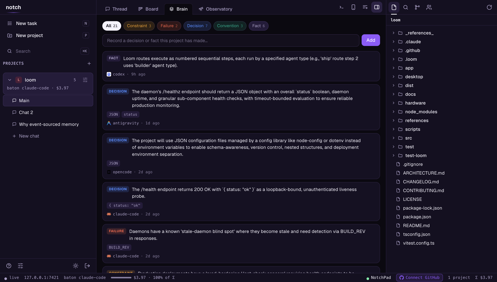
  <br>
  <em>The Brain tab — learned memory units, grouped by kind, each traceable to the turn it came from.</em>
</p>

## How it works

- **Event log** (`.loom/log.db`, SQLite via `node:sqlite`, JSONL fallback) — every
  message, tool call, file edit, decision, and handoff, appended in order. The log *is*
  the project's memory; everything else is a view of it.
- **Projection** — on handoff, Notch distills the log into
  `.loom/memory/<agent>.md` (persistent, namespaced) and arms a short one-shot briefing
  injected with the target's next turn (system-prompt append for Claude Code, delimited
  preamble for OpenCode). Two renderers behind one interface:
  - **template** (default) — deterministic, instant, free;
  - **llm** — a small Claude model distills the recent log into a dense doc
    (mission / current state / decisions / risks / next moves). Opt in per project:
    `"projection": { "mode": "llm", "model": "haiku" }`. Any failure or timeout falls
    back to the template — a broken Claude never blocks a handoff. Bridges always get
    template views (no N×LLM waste per hop).
- **Baton** — persisted per project (`.loom/state.json`). Messages route to the holder;
  addressing a non-holder returns `409 not_holder` and the surface asks you to confirm a
  handoff. Ghost holders (agent removed from config) self-heal. Every handoff snapshots
  the outgoing agent's working-tree state (dirty flag + `git status`) into the log.
- **Unified memory ("multiple memory in one")** — each connected ADE keeps its own
  native memory (`CLAUDE.md`, `AGENTS.md`, …). Notch imports them all into one brain
  (`memory_import` events, content-hash deduped), merges them with the project's
  decisions and shared thread, and projects the union into whoever holds the baton.
  Connect a new agent → its knowledge joins the brain, and everything the others learned
  flows into it. `loom memory` shows the merged brain; it refreshes on open and on every
  handoff. This is the seam an isolation-first tool (separate worktrees) can't own.
- **Decisions** — `loom decision <text>` pins a fact, and any agent line starting
  `Decision: …` is captured automatically. Decisions ride every future projection.
- **Cost telemetry** — agents that report per-turn cost (Claude Code, OpenCode) feed a
  live ledger: `loom costs` breaks it down per agent, the board/TUI/phone app show the
  project total, and every route logs exactly what it spent
  (`✔ route completed (3 steps) · $0.0421`). Totals rehydrate from the event log, so
  they survive restarts.
- **Daemon** — one process, many projects. REST for commands, WebSocket for the live
  stream. Config edits hot-reload when the project is quiet.

## Your phone (Android today, over Tailscale)

The daemon serves a full phone app at `/app` — board, live thread, agent chips, routes.
No app store, no build step; it ships inside Notch.

**Pair from the app.** The web/desktop window has a **Connect a phone** button next to the
terminal: it opens a modal with a QR (and a copy link) and a **Local network / Tailnet**
toggle. Pick one and, if the daemon is still localhost-only, hit **Enable phone access** —
Notch adds a *second listener* on that LAN or tailnet IP (localhost is never disturbed, so
the window you're in doesn't blink) and shows a QR your phone can actually reach. Same
single-use token, no terminal needed.

**Or pair from the terminal:**

```bash
loom up --tailnet     # daemon binds to your Tailscale IP (never 0.0.0.0)
loom pair             # QR appears in the terminal (also `/pair` inside `loom tui`)
```

Scan the QR with your phone camera (for the tailnet path, the phone must be on your
tailnet — install the Tailscale app and sign in; the local-network path just needs the
same Wi-Fi). The link opens `…/app#pair=<token>`; the app claims the **single-use,
10-minute** pairing token from the URL fragment (fragments never hit the network log) and
exchanges it for its own client token. Then:

- **Board** — every project, needs-input dots, baton holder, live route progress.
- **Thread** — the same shared conversation, streaming over WebSocket.
- **Agent chips** — tap `opencode`, hit send: baton shifts (projection + briefing
  included), exactly like `tab` in the TUI.
- **Routes** — the ➤ button opens a picker: choose **auto** (LLM picks each hop), any
  named pipeline, or custom steps, type the task, go. Live banner with hop progress and
  reasons, an abort button, and when a route pauses on a question you answer right
  there and it resumes.
- Chrome menu → *Add to Home screen* installs it like an app.

**The native app has the whole Observatory.** The phone reaches
`Thread · Observatory · Ask Noz · Tasks · Changes · Tools`, with all eight views under
the same names and in the same order as the desktop — Metrics, Live fleet, Handoffs,
Self-heal, Timeline, Decisions, Logs, Replay — plus per-agent triage, decision detail, and
a **Tools** tab covering Skills, MCP
servers and agent enable/roles. It is native, not a webview: `react-native-svg` isn't a
dependency, so the charts are proportional bars and a polyline built from plain views, and
the replay scrubber is a pan gesture over a measured track. The same honesty rules apply —
an unmeasured confidence says so rather than showing 0%, and an empty run draws an empty
state rather than a decorative sparkline.

**Push notifications** come with the native app ([`app/`](app/README.md)): open it once
after pairing and it registers its Expo push token with the daemon. From then on your
phone buzzes when an agent **needs input**, when a **route completes or fails**, and
when a solo turn finishes — route hops are deliberately silent (a 5-step pipeline
buzzes once, not five times). Verify with `loom clients --ping`.

## Security model

- The daemon binds to `127.0.0.1` by default, or your **Tailscale interface** with
  `--tailnet` — never `0.0.0.0` on its own. **Connect-a-phone** can *add* a listener on a
  specific LAN/tailnet IP (never `0.0.0.0`, never an arbitrary host — the target is
  allow-listed to this machine's own addresses), and only when you ask. The tailnet is the
  trust boundary: device auth and E2E encryption come from Tailscale.
- Every request needs a bearer token (`~/.loom/daemon.json`, mode 0600). Tokens are
  256-bit random and compared in constant time. **One route sits deliberately in front of
  that wall**: `POST /api/webhooks/signoz`, because Alertmanager posts to it and has no
  Notch token to carry. It has its own door instead — `NOTCH_WEBHOOK_SECRET`, sent as
  `?token=` or `x-notch-secret`. Be clear about what that means: with no secret set and the
  daemon on loopback the webhook is **open to any local user**, who could quarantine an
  agent, move the baton, and append status events the shared brain then reads. That is the
  same trust boundary as the local admin console below, and it is the default. Bound past
  localhost (`--host`, `--tailnet`) with no secret set, the webhook refuses with a 401 that
  names the variable, rather than serving a stranger the fleet's steering wheel.
- **The local admin console.** A same-machine window bootstraps the admin token via
  `GET /api/bootstrap` — gated by *both* a loopback TCP peer *and* a loopback `Host` header
  (the second is the anti-DNS-rebinding check: a malicious page carries its own hostname,
  so it's refused even though its socket rebound to 127.0.0.1). A remote window gets 403
  and pairs like any device. Caveat: on a **shared multi-user host**, any local user can
  reach loopback, so treat "same machine" as "trusted" — don't run the daemon on a box
  where you don't trust the other logins.
- Pairing: `loom pair` (or the in-app button) mints a **short-lived (10 min), single-use**
  token as a QR. The device exchanges it for a long-lived client token. The pairing token
  rides in a URL *fragment* (`…/app#pair=…`), which browsers never put on the wire; the
  client/admin token rides in the `Authorization` header (HTTP) and, preferred, the
  WebSocket **subprotocol**, so it stays out of history and proxy logs. The WebSocket
  handshake does still accept `?token=` as a fallback, for the CLI and native clients that
  can't set a subprotocol — those connections do put the token in a URL, where a proxy's
  request-line log can catch it.
- **What a paired client can do:** everything in the project, *including a real shell*
  (the terminal). Pairing a device therefore grants **arbitrary code execution as the
  daemon's user** — the shell is not confined to the project directory. That is the
  deliberate trade for a dev tool (bearer + tailnet is the boundary); pair only devices
  you control. Paired clients are **not** admins for most of this: minting a pairing token
  and adding the phone-access listener both need the admin token, which only the local
  console or the CLI holds. One gap is honest to name — `POST /api/loompad/funnel` carries
  no admin check and runs `tailscale funnel`, so any paired client can put the LoomPad voice
  backend's port on a public Funnel URL. Given the bullet above (a paired device already has
  a shell as the daemon's user), it isn't the weakest link, but "paired clients can't open
  new network exposure" would be the wrong thing to believe.
- The daemon survives a bad turn: unhandled rejections and exceptions are caught and
  logged (Console + `~/.loom/daemon.log`) rather than taking every project down, and
  `SIGINT`/`SIGTERM` shut it down cleanly.

## Adapter SDK

Add an agent in ~40 lines — implement the contract, register the kind:

```ts
import { AdapterBase, registerAgentKind, type SendInput } from "notch/sdk";

class MyAgentAdapter extends AdapterBase {
  async available() { return true; }
  async start() {}
  async stop() {}
  async send(input: SendInput) {
    this._busy = true;
    try {
      // …drive your agent; stream progress:
      this.emit({ kind: "message", payload: { text: "done!" } });
      this.emit({ kind: "run_complete", payload: {} });
    } finally { this._busy = false; }
  }
  async interrupt() {}
}

registerAgentKind("my-agent", (cfg, dir) => new MyAgentAdapter(cfg.id, "my-agent", dir));
```

Full guide: [docs/adapters.md](docs/adapters.md). Design rationale and every decision
with its why: [ARCHITECTURE.md](ARCHITECTURE.md).

## Configuration

`.loom/config.json` (created by `loom init`, hot-reloaded on edit):

```json
{
  "name": "my-project",
  "agents": [
    { "id": "claude-code", "kind": "claude-code", "role": "planner" },
    { "id": "opencode",    "kind": "opencode",    "role": "executor",
      "options": {} },
    { "id": "antigravity", "kind": "antigravity-cli", "role": "general" },
    { "id": "kiro", "kind": "kiro", "role": "general",
      "options": { "debugPort": 9334 } }
  ],
  "defaultAgent": "claude-code",
  "routes": { "ship": ["planner", "executor", "planner"] }
}
```

Roles are free text — `planner` and `executor` above are just the names this
example chose, and its `ship` route refers to them by those names. Claude Code options:
`permissionMode` (default `acceptEdits`), `model`. OpenCode options:
`model` (`"providerID/modelID"`, e.g. `"opencode/minimax-m2.5"` — **set this**: headless
sessions don't inherit your TUI default), `agent`, `baseUrl` to reuse a running server.

## Development

```bash
npm test          # 732 tests across 57 files: unit + full HTTP/WS end-to-end
npm run build     # tsc → dist/
npm run dev       # run the CLI from source (tsx)
```

## Environment

| Variable | What it does |
|---|---|
| `LOOM_HOME` | Where the registry, daemon config, and pair tokens live. Default `~/.loom`. Point it at a temp dir to try Notch without touching real state. |
| `LOOM_STORE` | `jsonl` forces the portable event store instead of `node:sqlite`. Notch falls back on its own if sqlite is unavailable; this makes it explicit. |
| `LOOM_NO_PTY` | `1` forces the pipe-backed shell instead of a real pty. CI runs the suite both ways. |
| `LOOM_NODE` | Node binary the desktop shell spawns the daemon with (Electron's own Node predates `node:sqlite`). |
| `LOOM_NO_NOTIFY` | `1` silences desktop notifications. |
| `LOOM_NO_PUSH` | `1` silences phone push. |
| `LOOM_ROUTE_STEP_TIMEOUT_MS` | Per-hop route timeout. Default 45 min. |

**Observability & self-heal:**

| Variable | What it does |
|---|---|
| `NOTCH_OTEL_ENDPOINT` / `OTEL_EXPORTER_OTLP_ENDPOINT` / `SIGNOZ_ENDPOINT` | OTLP collector base URL. Default `http://localhost:4318`. |
| `SIGNOZ_INGESTION_KEY` / `SIGNOZ_ACCESS_TOKEN` | Sent as `signoz-access-token` for SigNoz Cloud. |
| `NOTCH_CLICKHOUSE_URL` | ClickHouse HTTP for the read-back (triage/health/burn/replay). Default `http://localhost:8123`. |
| `NOTCH_SIGNOZ_URL` | SigNoz **UI** base for the "View in SigNoz" / trace deep links. Default `http://localhost:8080` — **which is not where `scripts/signoz-up.sh` puts the UI.** That script publishes it on `8085`, so if you followed the quickstart, the default points at nothing and every deep link is dead. Set `NOTCH_SIGNOZ_URL=http://localhost:8085` (or `SIGNOZ_UI_PORT` when starting the stack, to match). |
| `DO_NOT_TRACK=1` · `NOTCH_TELEMETRY_DISABLED=1` · `NOTCH_OTEL=0` | Any one opts out of all export. |
| `NOTCH_OTEL_METRICS=0` / `NOTCH_OTEL_LOGS=0` | Drop just that signal while traces keep exporting. Both are on whenever export is on; only the literal value `0` turns one off. |
| `NOTCH_SERVICE_NAME` | The `service.name` on every exported span, metric and log. Default `notch`. Change it and SigNoz files the fleet under a different service. |
| `ANTHROPIC_API_KEY` | Enables LLM triage prose headlessly (else the signed-in `claude` CLI, else heuristic). |
| `NOTCH_TRIAGE_MODEL` | Override the triage model. Default `claude-haiku-4-5-20251001`. |
| `NOTCH_TRIAGE_NO_LLM=1` | Skip both LLM paths in Self-Triage and answer from the deterministic heuristic. For tests, or an operator who wants no model in the loop. |
| `NOTCH_DECISIONS_NO_CLI=1` | Skip the local-CLI tier of decision capture (`agy --print` / `claude -p`), leaving API-then-regex. Set it if you don't want the daemon shelling out to a model after every turn. |
| `NOTCH_WEBHOOK_SECRET` | Shared secret for `POST /api/webhooks/signoz` (via `?token=` or `x-notch-secret`). **Optional while the daemon is on loopback, required once it binds past localhost** — without it, a non-loopback daemon answers that webhook with a 401. |
| `NOTCH_HEAL_RECHECK_MS` | Self-heal recheck interval. Default `60000`. |
| `NOTCH_HEAL_MAX_RETRIES` | Self-heal recheck attempts before giving up. Default `3`. |
| `NOTCH_HEAL_DISABLED=1` | Turn off the background recheck loop (the resolved-alert fast lane still works). |

Going the other way, Notch **sets `LOOM_TERMINAL=1`** inside every terminal it opens, so
your shell profile can tell it's running in Notch's pane. (`LOOM_EXPO_PUSH_URL` and
`LOOM_TUI_SMOKE` also exist, but they're test plumbing — not configuration.)

## Roadmap

- Tasks beyond GitHub and Linear — the board's source row is GitHub / Projects / Linear
  today. GitLab is not in it at all; only its brand mark is in the icon set.
- More adapters/bridges via the SDK — contributions welcome.

## Design

Every Notch surface (web app, desktop shell, phone app) wears one **purple-dark**
identity: a violet-tinted void, plum panels, Geist type, and color reserved for
state (thread violet = live, shuttle fuchsia = the baton). Recolored from the
"quiet graphite" system adapted from [Orca](https://github.com/stablyai/orca)
(MIT, © Lovecast Inc.); the Geist typeface is © Vercel under the SIL Open Font
License 1.1. Tokens and rules: [docs/design-system.md](docs/design-system.md).

## License

MIT © Nivesh Gajengi
